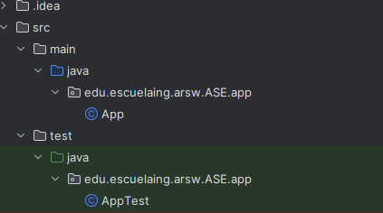

# Lab 1 – Introducción a Maven

Este laboratorio introduce el uso de como herramienta de construcción, empaquetado y manejo de dependencias en proyectos Java.

---

## ¿Qué es Maven?

Maven es una herramienta de gestión y construcción de proyectos que:

- Estandariza la estructura física de los proyectos.
- Maneja automáticamente las **dependencias** (librerías externas).
- Administra el **ciclo de vida de construcción** de software:
  - Descarga dependencias
  - Compila el código
  - Ejecuta pruebas
  - Genera reportes
  - Empaqueta el proyecto (JAR/WAR)
  - Despliega en entornos de integración/producción
- Se basa en el principio de **convención sobre configuración**.

---

## Instalación de Maven

1. este paso se salta debido a que ya estaba instalado en las maquinas 

## Creación de proyecto con Maven

Para crear un proyecto nuevo con Maven use el siguiente comando:

```bash
mvn archetype:generate \
  -DgroupId=edu.escuelaing.arsw.ASE.app \
  -DartifactId=lab1 \
  -DarchetypeArtifactId=maven-archetype-quickstart \
  -DarchetypeVersion=1.4 \
  -DinteractiveMode=false


Y así quedaría la estructura de las carpetas




