# Lab 1 – Introducción a Maven

Este laboratorio introduce el uso de como herramienta de construcción, empaquetado y manejo de dependencias en proyectos Java.

---

## ¿Qué es Maven?

Maven es una herramienta de gestión y construcción de proyectos que:

- Estandariza la estructura física de los proyectos.
- Maneja automáticamente las **dependencias** (librerías externas).
- Administra el **ciclo de vida de construcción** de software:
  - Descarga dependencias
  - Compila el código
  - Ejecuta pruebas
  - Genera reportes
  - Empaqueta el proyecto (JAR/WAR)
  - Despliega en entornos de integración/producción
- Se basa en el principio de **convención sobre configuración**.

---

## Instalación de Maven

1. este paso se salta debido a que ya estaba instalado en las maquinas 

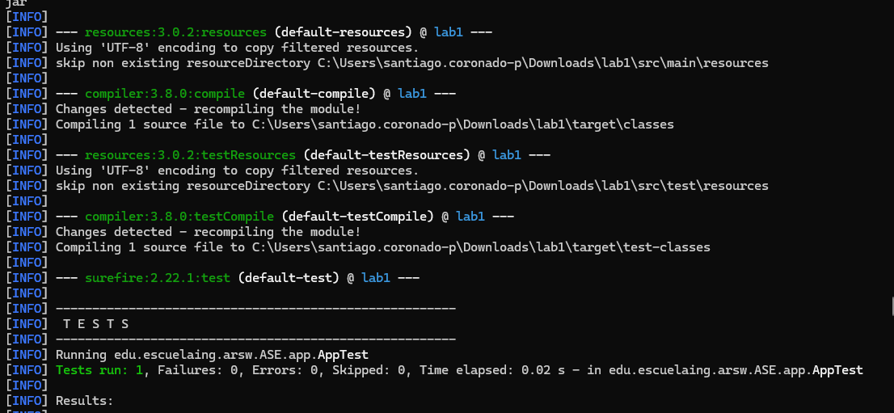

## Creación de proyecto con Maven

Para crear un proyecto nuevo con Maven use el siguiente comando:

mvn archetype:generate \
  -DgroupId=edu.escuelaing.arsw.ASE.app \
  -DartifactId=lab1 \
  -DarchetypeArtifactId=maven-archetype-quickstart \
  -DarchetypeVersion=1.4 \
  -DinteractiveMode=false


Y así quedaría la estructura de las carpetas

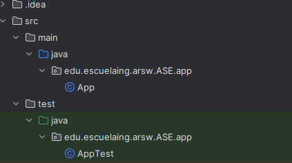


---


aqui vemos el main como se crea 
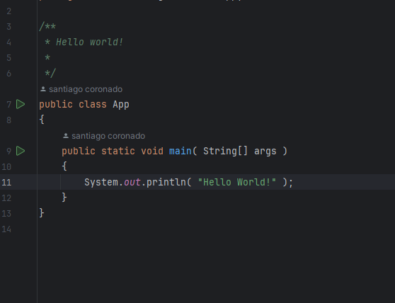

y el POM

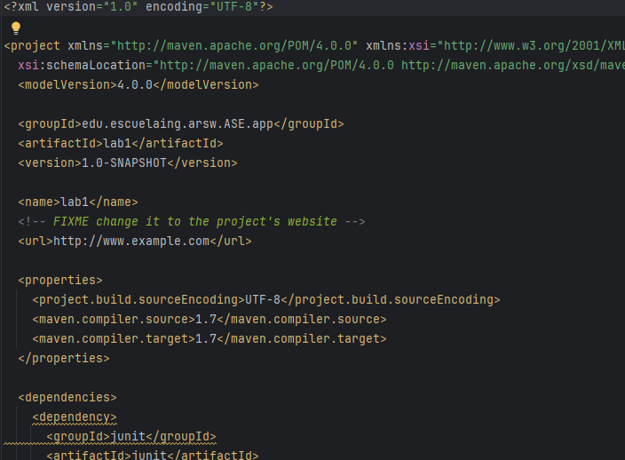

## Empaquetar el proyecto con Maven

Para compilar y empaquetar el proyecto, ejecuta en la terminal:

mvn package


pasamos a 

## Fases del ciclo de vida de Maven

Las fases del ciclo de vida por defecto que se usan comúnmente son:

- **validate**: Verifica que el proyecto sea correcto y que toda la información necesaria esté disponible.
- **compile**: Compila el código fuente del proyecto.
- **test**: Ejecuta pruebas unitarias usando un framework de pruebas concreto.
- **package**: Toma el código compilado y lo empaqueta en un formato específico, por ejemplo, un archivo JAR.
- **integration-test**: Procesa y despliega el software en un entorno donde se puedan ejecutar pruebas de integración.
- **verify**: Ejecuta revisiones para verificar los criterios de calidad del paquete.
- **install**: Instala el paquete en el repositorio local para que esté disponible como dependencia para otros proyectos.
- **deploy**: Despliega el software en un ambiente de publicación de nuevas versiones o en producción.

### Otras fases comunes

- **clean**: Limpia los artefactos creados por construcciones previas.
- **site**: Genera el sitio de documentación para el proyecto.


## Encadenando fases y objetivos de plugin

Es posible encadenar varias fases y objetivos de plugins en un solo comando. Por ejemplo:

mvn clean dependency:copy-dependencies package


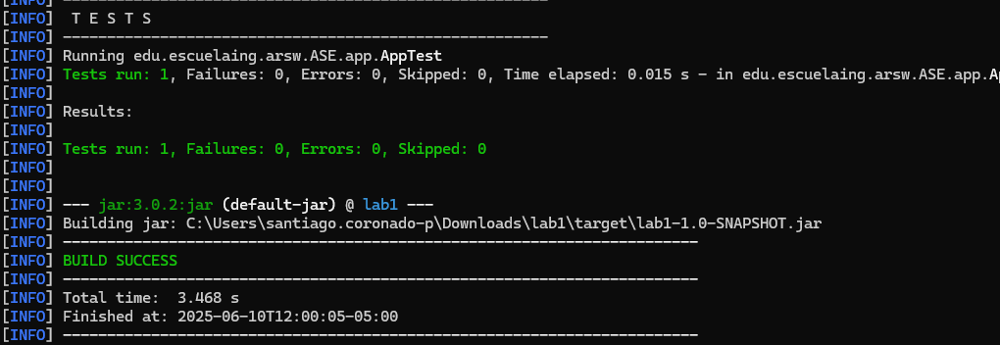


## Generar Javadoc en Maven

### 1. Generar Javadoc como parte del sitio de documentación (`site`)

Para incluir la generación del Javadoc como parte del sitio de documentación que Maven genera con `mvn site`, debes agregar el plugin `maven-javadoc-plugin` dentro de la sección `<reporting>` en el archivo `pom.xml`. Por ejemplo:


### 2. generar el Javadoc como parte del site

Agregar el plugin en la sección <reporting> para el sitio
Debes agregar esta sección <reporting> justo después de la sección <dependencies> (antes o después del <build>):

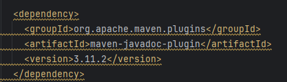


### 3. generar el javadoc como un elemento independiente de la documentación

Agregar el plugin en la sección <build><plugins> para generación independiente
Dentro del <build>, debajo de <pluginManagement>, añade o modifica la sección <plugins> (antes o después de <pluginManagement>) para incluir el plugin:

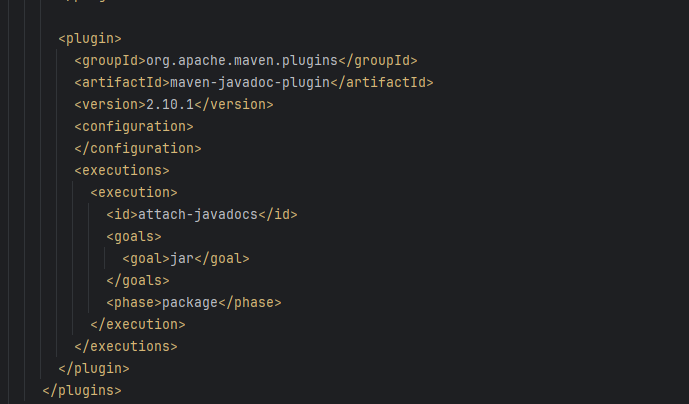


### 4. Comandos para generarlos:

mvn javadoc:javadoc
mvn javadoc:jar
mvn javadoc:aggregate
mvn javadoc:aggregate-jar
mvn javadoc:test-javadoc
mvn javadoc:test-jar
mvn javadoc:test-aggregate
mvn javadoc:test-aggregate-jar

### 5. Esto genera los javadoc y los empaqueta con el Jar.

yo utilice

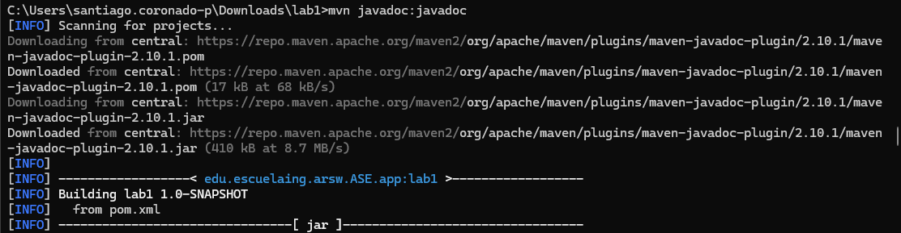

## Arquitectura de repositorios

Maven viene configurado con un repositorio por defecto:


Cada vez que se ejecuta Maven, descarga los plugins o dependencias necesarias y las almacena en el repositorio local.

- Una vez descargadas, no se vuelven a descargar a menos que sean borradas.
- Para librerías que no son libres o públicamente accesibles, puedes crear repositorios con los contenidos o desplegarlas localmente.

---

## Dependencias

Para cada dependencia se debe definir al menos:

- **groupId**: identifica el grupo o la organización que mantiene la librería.
- **artifactId**: nombre del artefacto o librería.
- **version**: versión específica de la dependencia.
- **scope**: puede tomar valores como `compile`, `test`, y `runtime`.

Maven primero busca las dependencias en su repositorio local y luego en los repositorios remotos configurados para obtenerlas.


como en este que tenemos Junit

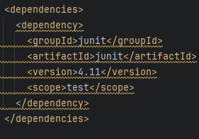
# GIT

## ¿Qué es Git?

Git es un **sistema de control de versiones**, lo cual significa que permite:

- Almacenar cambios sobre un archivo o un conjunto de archivos.
- Recuperar versiones previas de esos archivos.
- Gestionar ramas (**branches**) para desarrollar funcionalidades de manera independiente.

Además, Git facilita la colaboración entre múltiples desarrolladores y mantiene un historial completo de los cambios realizados en el código.

---

## Tipos de sistemas de control de versiones

Existen diferentes tipos de sistemas de control de versiones:

- **Sistema local de manejo de versiones**  
  Ejemplo: `RCS` (aún distribuido en los sistemas macOS).

- **Sistema centralizado de manejo de versiones**  
  Ejemplo: `Subversion` (SVN).

- **Sistema distribuido de manejo de versiones**  
  Ejemplo: `Git`.


# Instalación y configuración de Git


no lo instale, porque ya estaba 
---

## Instalar Git

Para instalar Git, seguí las instrucciones disponibles en el sitio oficial:

🔗 [Guía oficial de instalación de Git](http://git-scm.com/book/en/v2/Getting-Started-Installing-Git)

Una vez instalado, verifiqué la instalación ejecutando en la terminal:

git --version

## Configurar identidad de usuario y editor por defecto

Configuré mi nombre de usuario, correo electrónico y editor de texto por defecto con los siguientes comandos:

```bash
git config --global user.name "santiago coronado"
git config --global user.email retrollaso@gmail.com
```

## Verificar configuración

Para verificar que los valores se configuraron correctamente, utilicé el siguiente comando:

```bash
git config --list
```

que en mi caso sale:

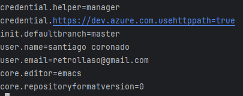


## Agregar archivos y conectar con repositorio remoto

Una vez inicializado el repositorio local, comencé a agregar archivos al control de versiones usando el comando:

```bash
git add pom.xml
git status
```


Luego, conecté mi repositorio local con el repositorio remoto que había creado en GitHub, asignándole el nombre origin:

```bash

Copy
Edit
git remote add origin https://github.com/dnielben/miprimerrep.git
Verifiqué que se haya agregado correctamente con:
```

```bash

Copy
Edit
git remote
git remote -v
```
Después, empujé mi proyecto local al repositorio remoto en la rama principal (main):

```bash

Copy
Edit
git push -u origin main
```


### Agregar más archivos al proyecto
### Agregué algunos archivos importantes al proyecto como:


Un archivo README.txt para describir el proyecto.

Un archivo LICENSE.txt con los términos de la licencia.

Un archivo .gitignore para excluir archivos innecesarios.

Los creé con los siguientes comandos:

```bash
Copy
Edit
echo 'Mi primer proyecto' > README.txt
```


y se crea igual tambien en el historial


## Clonar un repositorio remoto

Para probar cómo funciona Git al trabajar con copias, hice una clonación de mi repositorio remoto en otro directorio diferente al del proyecto original:

```bash
git clone https://github.com/Santiago12323/Laboratorio-1-Arsw.git
```
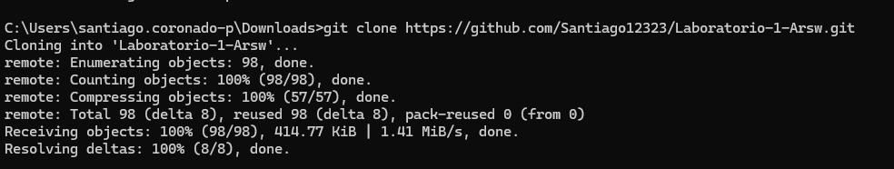


## Comandos útiles en Git
Ver cambios antes de agregarlos al área staged
Para ver exactamente qué líneas he modificado pero aún no he agregado al área staged:

```bash

Copy
Edit
git diff
Ver cambios agregados al área staged (pero aún no confirmados)
```

```bash
Copy
Edit
git diff --staged
Hacer commit directamente sin pasar por staged
Cuando quiero confirmar todos los archivos modificados que ya están siendo rastreados por Git, puedo hacer un commit directo así:
```

```bash
Copy
Edit
git commit -a -m "commit directo sin pasar por staged"
Eliminar archivos en Git
Quitar un archivo del directorio (pero no del control de versiones)
```

```bash
Copy
Edit
rm archivo.txt
Quitar un archivo del control de Git (y confirmar su eliminación)
```
```bash

Copy
Edit
git rm archivo.txt
git commit -m "Confirmar la eliminación del archivo"
Quitar un archivo del área staged (sin eliminarlo físicamente)
Copy
Edit
git rm --cached archivo.txt
Usar patrones para eliminar múltiples archivos
```

```bash

Copy
Edit
git rm log/*.log     
git rm *~             
```

### para subir tus cambios al repositorio se debe seguir los siguientes pasos

agregar los cambios al historial local de git

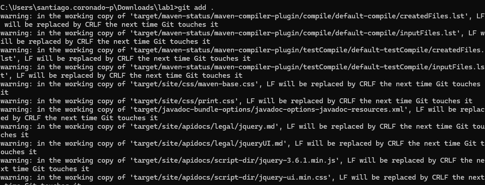

hacer un commit de ese historial nuevo

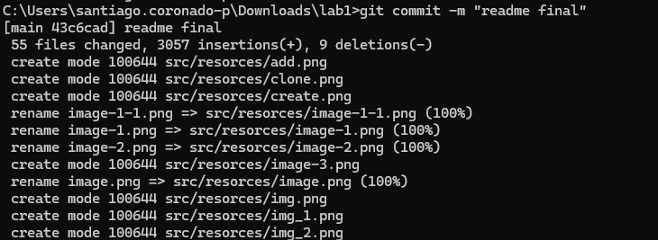

y subir los cambios al repositorio en git hub


